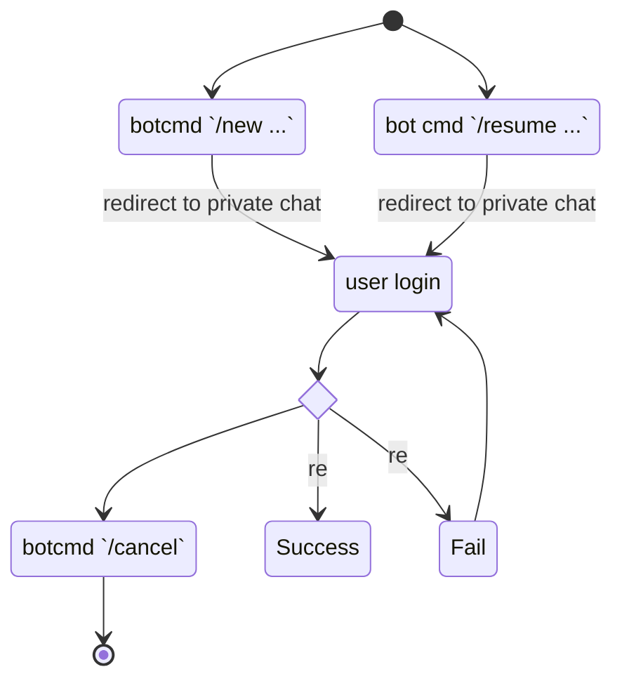

# Bots

A `bot` is a component receiving messages and act automatically.

## Concepts

- `workflow`: a set of bot commands to complete certain task
- `botcmd`: predefined text message triggering bot actions

We define following botcmds:

- `/new`: request a new workflow run
- `/resume`: resume a previously requested workflow run
- `/ignore`: ignore certain message during the workflow run
- `/include`: include extra information during the workflow run
- `/edit`: edit generated content of previous workflow run
- `/list`: list workflow run results
- `/delete`: delete certain workflow run result
- `/end`: end current workflow run
- `/cancel`: cancel the workflow run request

## State Machine of botcmds

`/new` can be treated as the entrance of the workflow, once received
